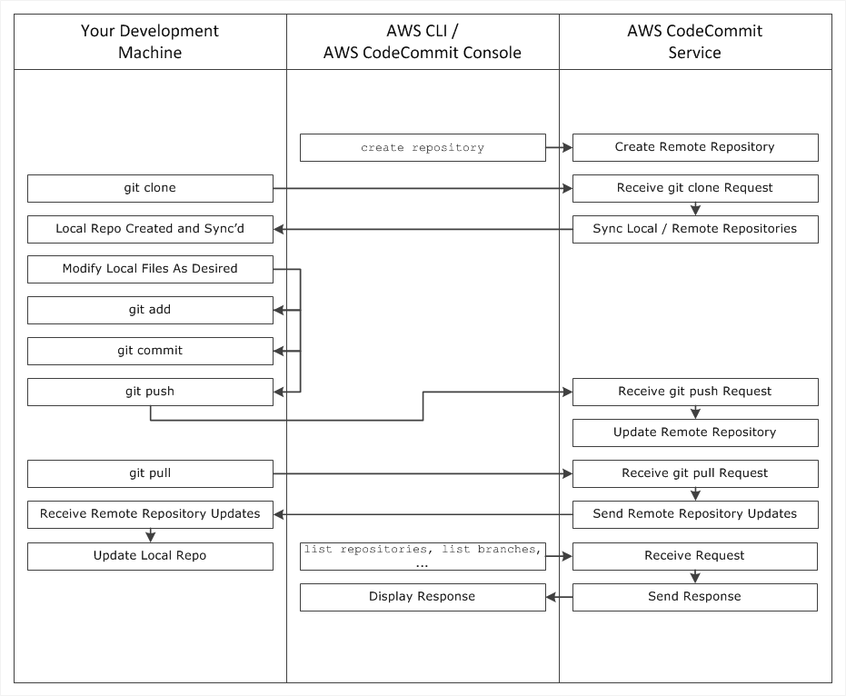
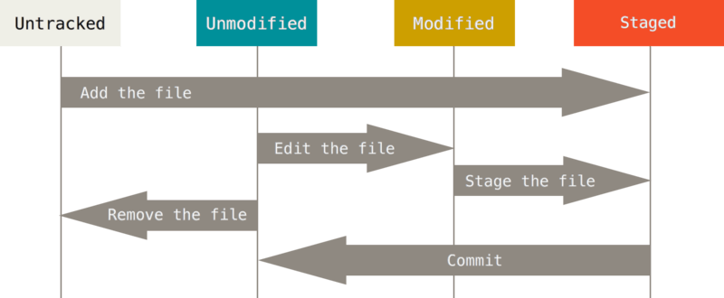

# Git

Un dépôt (*repository*) consiste de 3 structures arborescentes maintenues et monitorées par git. Le premier est votre répertoire de travail (*working directory*) et contient les fichiers sur lesquels vous travaillez. Le second est l'**Index** qui agit comme une aire de transition et finalement la tête (**HEAD**) qui pointe le dernier commit qui a été fait.

La zone d’index est un simple fichier, généralement situé dans le répertoire Git, qui stocke les informations concernant ce qui fera partie du prochain instantané.

Voyez Git comme un photographe qui prend une photo avec sa camera (répertoire de travail), puis la télécharge sur son ordinateur (HEAD) et lorsque prêt la publie sur son site web (**Remote Repository**). Avant de télécharger les photos dans l'ordinateur, il vérifie si il a de nouvelles photos sur sa caméra qui diffèrent de celles de son ordinateur (ce serait son **Index** / phase *staging*).

Plus tard quand il veut publier son travail sur son site web ou télécharger les photos les plus récentes sur son site web qui pourraient avoir été déjà envoyées par un collègue, il compare les photos sur son ordinateur (**HEAD**) et son site web (**Remote Repository**), et va seulement transférer (upload/download) les nouvelles photos.

Il y a beaucoup plus que ça avec Git, mais cela vous donne une bonne idée du le workflow.

Later when he wants to publish his work to his website or in return download the newest photos on his website that might have been uploaded by his co-worker he compares the photos that are in his computer (HEAD) and his website (Remote Repository) and only downloads or uploads the new photos . Of course that there is much more to that then this but for now it will help you understand the general idea behind the workflow.

Traduction maison de [cette page](https://medium.com/@talgoldfus/better-understanding-gits-work-flow-in-order-to-properly-deal-with-merge-conflicts-part-i-760a366fc997 "Better understanding Git workflow") et d'éléments pris ailleurs.

## Term Definition

| Terme | Définition |
| --- | --- |
| index | The *staging* area of a repository. Changes we include with the add command are *stored* here. When we create a commit, it is the index content that is included |
| branch | An isolated line of development which spawns from a certain point of its *parent* |
| commit |An operation which consists into integrating the changes stored in the index of a repository into the repository history |
| HEAD | A reference to the last commit of a branch |
| working tree | The directory associated with our repository; usually, but not necessarily, the one containing the .git subdirectory |
| checkout | The act of switching between different states of a repository, represented by branches or commits |

## Workflow

L’utilisation standard de Git se passe comme suit:

1. vous modifiez des fichiers dans votre répertoire de travail;
2. vous indexez les fichiers modifiés, ce qui ajoute des instantanés de ces fichiers dans la zone d’index;
3. vous validez, ce qui a pour effet de basculer les instantanés des fichiers de l’index dans la base de données du répertoire Git.

Si un remote repository est utilisé, il y aurait une étape préalable (initialiser le dépôt local avec les données du dépôt distant) et une étape finale 
(synchroniser les changements avec le dépôt distant).

Mêmes commandes, mais selon la ligne de temps:

      
      
## Exemple de Workflow avec AWS CodeCommit

## Cycle de vie des états des fichiers

## Commandes principales

### Configuration

   La configuration peut être globale (/etc/gitconfig), globale à l'utilisateur (~/.gitconfig) et dans le répertoire de travail (.git/config).

   Configurer le nom de l'utilisateur::
     
      git config --global user.name "My name"
         
   Configurer l'adresse de courriel::
      
      git config --global user.email "my.email@domain.com"
         
   Sauvegarder les crédentiels pour le repo distant::
      
      git config credential.helper store
         
   Ignore les problèmes de certificats::
      
      git config --global http.sslVerify false
      
   Configurer l'éditeur de texte à utiliser::
   
      git config --global core.editor vim
         
   Configure le proxy à utiliser::
      
      git config --global https.proxy https://httpproxy:3128
      git config --global http.proxy http://httpproxy:3128

   Lister les éléments de la configuration en fonction::
   
      git config [-l | --list]
      
### Initialisation
   
   Initialise un répertoire pour suivi de version::
      
      git init
         
   Cloner un repo existant::
      
      git clone https://github.com/DesertRider/cheatsheet.git
      git clone ssh://user@site.com/directory/repository.git
         
### Changements
   
   Ajouter un fichier ou répertoire au suivi de version::
      
      git add répertoire/fichier
      
   Retirer un fichier ou répertoire du suivi de version::
   
      git rm --cached répertoire/fichier
      # si pas de --cached, git va effacer le fichier et cesser de monitorer ses changements
      
   Désindexer un fichier indexé (mis dans le *stage area*) (pas de changement au fichier toutefois)::
   
      git reset HEAD fichier
      
   Retourner un fichier à l'état indexé::
   
      git checkout fichier
      
   Enlever le dernier changement qui a eu un *commit*::
   
      git revert HEAD

   Voir les modifications récentes::
      
      git log [fichier] [--pretty=one-line] [--all]
      git log --pretty=format:'%h %ad | %s%d [%an]' --graph --date=short
      # on peut avoir des réglages de formattage dans gitconfig (général, ou par repos)
         
   Voir ce qui a changé pour un fichier depuis une certaine version::
      
      git diff
         
   Affiche les changements en attente d'un commit::
      
      git status [-s | --short]
      
   Pousse les changements dans le repo local::
      
      git commit [ -m message ]
      
   Change le dernier commit pour un changement mineur (amendement)::
   
      git commit -amend [ -m message ]
         
   Pousse les changements commits dans le repo distant::
      
      git push
         
   Récupère les changements qui sont dans le repo distant::
      
      git pull
      
   Ignorer des répertoires/fichiers::
   
      créer un fichier .gitignore et lister les éléments à ignorer (1 par ligne, wildcard ok, 
      commentaires débutent par #)
    
### Remote repository

   Afficher les informations sur les remote repositories utilisés::
   
      git remote -v

## Différents cas d'initialisation d'un repo

### Create a new from scratch repository

      git init myrepo
      cd myrepo
      touch README.md
      git add README.md
      git commit -m "add README"
      git remote add origin https://site.com/directory/myrepo.git
      git push -u origin master

### Create a new repository from a remote one
   
      # initialize by cloning from git site
      git clone https://site.com/directory/myrepo.git
      # or initialize an empty directory
      git init myrepo
      cd myrepo
      touch README.md
      git add README.md
      git commit -m "add README"
      git push -u origin master

### Existing folder

      cd existing_folder
      git init
      git remote add origin https://site.com/directory/myrepo,git
      git add .
      git commit -m "Initial commit"
      git push -u origin master

### Existing Git repository
   
      cd existing_repo
      git remote rename origin old-origin
      git remote add origin https://site.com/directory/myrepo.git
      git push -u origin --all
      git push -u origin --tags

## Personnalisation du message lors du commit

    cat > ~/.gitmessage <<FIN
    # |<--- Résumez le changement en 50 car. max --->|
    
    # Sautez une ligne et décrivez le pourquoi et non le comment du changement
    # |<---- Essayez de vous limiter vos lignes à 72 caractères max!  ---->|

    # Vous pouvez ajouter d'autres paragraphes, par exemple une référence
    # au billet qui signale le problème, ...
    FIN

    git config --global commit.template ~/.gitmessage
    
 ***
 
